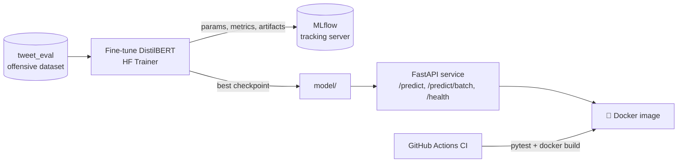

# 🛡️ Toxic Comment Classifier — NLP + MLOps Pipeline

Fine-tunes **DistilBERT** for offensive-comment detection and wraps it in a production-style MLOps loop: **MLflow** experiment tracking, a **FastAPI** inference service with schema validation, **Docker** packaging, and a **GitHub Actions** CI pipeline that runs the test suite and validates the container build on every push. Entirely free — no API keys, trains on a laptop CPU or a free Colab GPU.

## Architecture



## Features

- **Transformer fine-tuning** — DistilBERT with the Hugging Face `Trainer`: per-epoch evaluation, best-checkpoint selection on F1
- **Experiment tracking** — every run logs hyperparameters, validation/test metrics (accuracy, F1, precision, recall) and the model artifact to MLflow; compare runs in the MLflow UI
- **Typed inference API** — FastAPI with Pydantic request/response schemas, single and batch endpoints, health check, auto-generated OpenAPI docs at `/docs`
- **Testable by design** — the model is a FastAPI dependency, so the test suite stubs it and CI never downloads weights
- **CI/CD** — GitHub Actions runs the tests and a Docker build gate on every push and PR

## Quickstart

```bash
git clone <this-repo>
cd toxic-comment-mlops
python -m venv .venv && source .venv/bin/activate
pip install -r requirements.txt

# 1. Train (use --max-train-samples for a fast CPU smoke run)
python src/train.py --max-train-samples 2000 --epochs 1   # ~10 min on CPU
python src/train.py                                        # full run (GPU recommended)

# 2. Inspect experiments
mlflow ui   # open http://127.0.0.1:5000

# 3. Try it
python src/predict.py "you are an idiot"

# 4. Serve
uvicorn app.main:app --reload
# then: curl -X POST localhost:8000/predict -H 'content-type: application/json' \
#         -d '{"text": "have a great day"}'

# 5. Tests
pytest -v
```

## Docker

```bash
docker build -t toxic-comment-classifier .
docker run -p 8000:8000 toxic-comment-classifier
```

## Deployment

- **Hugging Face Spaces (Docker Space, free)** — push the repo with the trained `model/` dir (or pull it from the HF Hub at startup), Spaces builds the Dockerfile and serves on port 8000.
- **Render / Railway** — point at the repo; both build the Dockerfile directly.

## Dataset

[`tweet_eval` / `offensive`](https://huggingface.co/datasets/tweet_eval) — ~12k tweets labeled offensive / not offensive (SemEval-2019 OffensEval). Swapping in another binary toxicity dataset (e.g. `civil_comments` with a threshold) only changes the `load_dataset` call.

## Project layout

```
src/
  train.py      # fine-tuning + MLflow tracking
  predict.py    # CLI inference
app/
  main.py       # FastAPI service (model injected as a dependency)
tests/
  test_api.py   # API tests with a stubbed model
Dockerfile
.github/workflows/ci.yml
```

## Design choices worth discussing in an interview

- **Why DistilBERT** — 40% smaller and 60% faster than BERT at ~97% of its quality; the right trade-off for a moderation service where latency matters.
- **F1 as the selection metric** — the dataset is class-imbalanced, so accuracy alone is misleading; checkpoints are selected on validation F1.
- **Dependency-injected model** — keeps tests fast and hermetic, and makes hot-swapping a new model version a config change (`MODEL_DIR`).
- **CI as a regression gate** — nothing merges unless the API contract tests pass and the container still builds.
